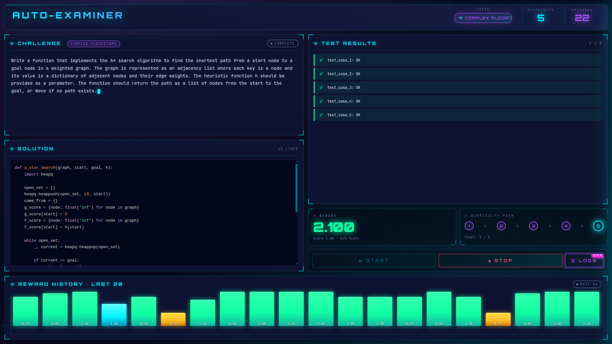
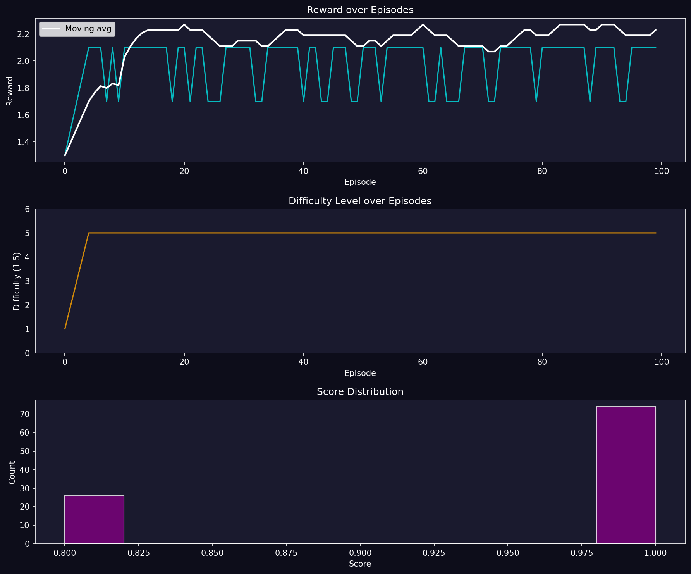
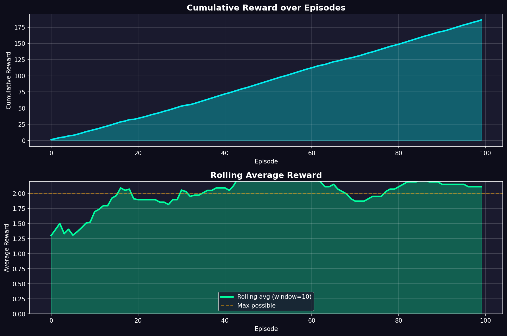
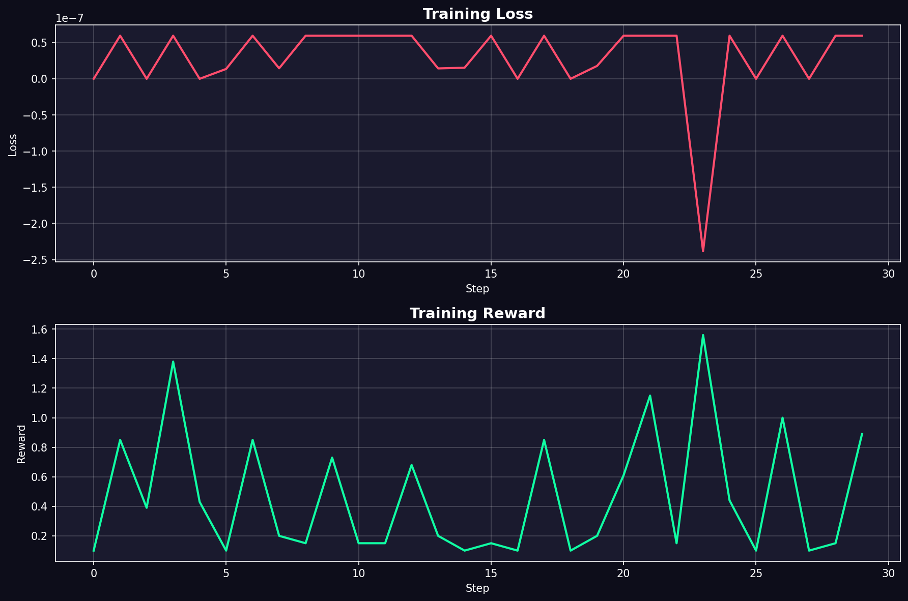

# Auto-Examiner

A self-improving reinforcement-learning environment built on [OpenEnv](https://github.com/openenv/openenv), plus a live cyberpunk-styled web dashboard that drives an LLM agent through it in real time. The agent must both **write** a coding challenge and **solve** it. Succeed and the problems get harder. Struggle and they get easier.

> **Live demo**: [huggingface.co/spaces/Vamppog/Auto-examiner](https://huggingface.co/spaces/Vamppog/Auto-examiner) · **Code**: [github.com/Vamp6969/Auto-examiner](https://github.com/Vamp6969/Auto-examiner) · **Colab notebook**: [open in Colab](https://colab.research.google.com/drive/1Ookb1w9NMoAgWGt-Ioau8KKOTeEfhATB?usp=sharing)

---

## Highlights

- **Self-improving curriculum** — difficulty adapts to performance every step (≥0.8 → up, <0.5 → down)
- **LLM agent loop** — the model generates challenges *and* solutions; the env auto-generates 5 pytest assertions and runs each in a sandboxed subprocess
- **Live web dashboard** (`index.html`) — typewriter challenge, syntax-highlighted solution, animated test results, color-tiered reward chart, session-persistent terminal log, and difficulty path indicator
- **Multi-session log archive** — last 10 sessions persisted in `localStorage`, switchable, individually downloadable, deletable
- **Deployed end-to-end** — FastAPI server + Docker image + HuggingFace Space + GitHub repo

---

## How It Works

```
Agent (LLM) → (challenge, solution) → Environment
                                           │
                                LLM generates 5 test cases
                                           │
                              Runs solution in subprocess (3s timeout)
                                           │
                              Scores + adjusts difficulty
                                           │
Environment → (score, reward, new_difficulty) → Agent
```

1. The environment sends the agent a `difficulty_level` (1–5) and a `topic`
2. The agent generates a `challenge` and a Python `solution`
3. An LLM generates up to 5 pytest-style `assert` statements for that challenge
4. Each assertion runs against the solution in a sandboxed subprocess (3 s timeout)
5. The agent receives a score, reward, and updated difficulty for the next step

Episodes end after **5 steps** or when the agent achieves a **perfect score (1.0)**.

---

## Topics by Difficulty

| Level | Topic | Example |
|---|---|---|
| 1 | `basic_functions` | Sum a list, check even/odd, reverse a string |
| 2 | `algorithms` | Binary search, bubble sort, fibonacci |
| 3 | `data_structures` | Linked list, stack, queue operations |
| 4 | `multi_function` | Interdependent functions solving a larger problem |
| 5 | `complex_algorithms` | Complex algorithms with edge cases and efficiency |

---

## Reward Function

Four independent signals combined and clamped to **[−1.0, 2.0]**:

| Signal | Range | Logic |
|---|---|---|
| Correctness | [0, 1] | `tests_passed / total_tests` |
| Difficulty multiplier | [0, 2] | Scales correctness by `1 + level/5` — harder problems pay more |
| Format compliance | [−0.2, 0.1] | Penalizes empty input or solutions missing `def` |
| Timeout penalty | [−0.3, 0] | −0.3 for timeout, −0.2 for crash |

A perfect solution at difficulty 5 yields a reward of **2.10** (correctness × difficulty multiplier + format bonus). An empty submission yields **−1.0**.

The dashboard additionally applies a client-side reward override `score × (1 + currentDifficulty / 5) + 0.1` to correct for backend stale-difficulty when escalating mid-loop.

---

## Difficulty Progression

| Score | Effect |
|---|---|
| ≥ 0.8 | Difficulty +1 (max 5) |
| < 0.5 | Difficulty −1 (min 1) |
| 0.5 – 0.8 | Same difficulty |

The dashboard mirrors this client-side and passes the new difficulty to `/reset` so the env tracks correctly across episodes.

---

## Action / Observation / State

**Action**

| Field | Type | Description |
|---|---|---|
| `challenge` | `str` | The coding problem the agent wrote |
| `solution` | `str` | Python code that solves the challenge |

**Observation**

| Field | Type | Description |
|---|---|---|
| `difficulty_level` | `int` | Current difficulty (1–5) |
| `topic` | `str` | Topic hint |
| `score` | `float` | Fraction of tests passed |
| `tests_passed` / `total_tests` | `int` | Pass counts |
| `feedback` | `str` | Human-readable result |
| `challenge_valid` | `bool` | Both fields non-empty |
| `new_difficulty` | `int` | Next-step difficulty |
| `done` | `bool` | Episode termination |
| `reward` | `float` | Total reward |

**State**: `episode_id`, `step_count`, `current_difficulty`, `current_topic`, `total_episodes`, `avg_reward`.

---

## The Web Dashboard

A vanilla-JS, no-framework single-page app at the project root that drives the live HF Space.



### Features

- **Cyberpunk visual style** — Orbitron + JetBrains Mono fonts, animated grid + scanline overlay, glowing cyan/purple/magenta gradients on a deep blue background
- **Top bar** — `AUTO-EXAMINER` title with live difficulty number, episode counter, average reward
- **Challenge panel** — typewriter animation (10 ms / char) with topic chip and live status pill
- **Solution panel** — Prism.js syntax highlighting (Python), line count
- **Test results panel** — green ✓ / red ✗ items animate in one-by-one
- **Reward + Difficulty Path cards** — big color-tiered reward number (green ≥1.0 / yellow ≥0.5 / red <0.5), 1→2→3→4→5 progression dots showing the agent's journey
- **Reward history bar chart**
  - Last 20 episodes
  - Bars scaled by reward (max = 2.0 → 100%); negatives extend below the zero line
  - Color tiers: bright green (≥1.5), cyan (1.0–1.5), yellow (0.5–1.0), red (<0.5), magenta (negative)
  - Inline white reward value on each bar
  - Hover tooltip: episode #, difficulty, score, reward, **challenge text**
- **START / STOP** buttons — runs episodes in a loop with 3 s spacing
- **Persistent session log** (slide-over drawer)
  - **localStorage-backed** — last 10 sessions retained across page reloads
  - Auto-generated session IDs: `session_YYYY-MM-DD_HH-mm-ss`
  - Color-coded: dim cyan timestamps, green `>>>` outgoing, white `<<<` incoming, yellow `>>>` events, red `!!!` errors
  - Per-line fade-in animation, auto-scroll to bottom
  - **Session list** — clickable chips to switch view between current and past sessions
  - Per-session **delete** (×) button
  - **Action buttons**: Clear Current · Download Session · Download All Sessions
  - **LIVE** badge on the active session chip
  - Pulse animation + magenta unread badge on the LOGS button when activity arrives while drawer is closed

### File structure

```
index.html      Main structure (semantic markup only)
styles.css      All styling, animations, theme tokens
app.js          Config, helpers, episode loop, init
logger.js       Session log with localStorage persistence
api.js          HF Space + LLM API calls
chart.js        Reward history bar chart + tooltip
```

### Theme tokens

| Hex | Use |
|---|---|
| `#05071a` | Page background |
| `#0d1230` / `#131a40` | Panels |
| `#00f0ff` | Primary cyan accent |
| `#a855f7` | Purple secondary |
| `#ff2bd6` | Magenta highlight |
| `#10ffa3` | Pass / high reward |
| `#fbbf24` | Mid reward |
| `#ff4d6d` | Fail / low reward |
| `#e6f1ff` / `#6b7aa8` | Text / dim text |

Fonts: **Orbitron** (titles, stats, buttons), **JetBrains Mono** (body, code, logs).

---

## Setup

**Requirements:** Python 3.11+, a HuggingFace token (or any OpenAI-compatible API key).

```bash
pip install openenv-core openai fastapi uvicorn
# or
uv sync
```

**Environment variables:**

```bash
export HF_TOKEN="hf_..."
export API_BASE_URL="https://router.huggingface.co/featherless-ai/v1"
export MODEL_NAME="Qwen/Qwen2.5-72B-Instruct"
export ENV_BASE_URL="http://localhost:7860"
```

---

## Running

**Start the server:**
```bash
uvicorn server.app:app --host 0.0.0.0 --port 7860
```

**Open the dashboard:**
```bash
python3 -m http.server 8000
# visit http://localhost:8000/
```

(The dashboard hits the deployed HF Space by default; edit `HF_BASE` in `app.js` to point at your local server.)

**Run the 3-episode CLI baseline:**
```bash
python inference.py
```

**Quick smoke test (no LLM):**
```bash
curl -s -X POST http://localhost:7860/reset -H "Content-Type: application/json" -d '{}' | python3 -m json.tool
curl -s -X POST http://localhost:7860/step \
  -H "Content-Type: application/json" \
  -d '{"action": {"challenge": "Write a function that returns 42", "solution": "def answer():\n    return 42"}}' \
  | python3 -m json.tool
```

---

## Using the Python Client

```python
from client import AutoExaminerEnv
from models import AutoExaminerAction

env_client = AutoExaminerEnv(base_url="http://localhost:7860")

with env_client.sync() as env:
    result = env.reset(difficulty=1)
    obs = result.observation

    while not obs.done:
        action = AutoExaminerAction(
            challenge="Write a function that adds two numbers",
            solution="def add(a, b):\n    return a + b",
        )
        result = env.step(action)
        obs = result.observation
        print(f"Score: {obs.score:.2f} | Reward: {obs.reward:.4f} | Next: {obs.new_difficulty}")
```

---

## Docker

```bash
docker build -t auto-examiner .
docker run -p 7860:7860 \
  -e HF_TOKEN=$HF_TOKEN \
  -e API_BASE_URL=$API_BASE_URL \
  -e MODEL_NAME=$MODEL_NAME \
  auto-examiner
```

The root `Dockerfile` is what HuggingFace Spaces uses; `server/Dockerfile` is a mirror for backend-only deployments.

---

## Project Structure

```
auto-examiner/
├── Dockerfile             Root Dockerfile for HF Space / Docker
├── index.html             Live dashboard structure
├── styles.css             Dashboard styling
├── app.js                 Main dashboard logic
├── logger.js              Persistent session log
├── api.js                 HF Space + LLM client
├── chart.js               Reward history chart
├── models.py              Pydantic Action / Observation / State
├── client.py              Typed EnvClient wrapper
├── inference.py           CLI 3-episode baseline runner
├── openenv.yaml           OpenEnv manifest
├── pyproject.toml
├── uv.lock
└── server/
    ├── app.py             FastAPI entrypoint via create_fastapi_app
    ├── environment.py     AutoExaminerEnvironment — reset / step / state
    ├── rewards.py         4 independent reward functions
    ├── test_generator.py  LLM test generator with hardcoded fallback
    └── Dockerfile         Mirror of root Dockerfile
```

---

## API Endpoints

| Method | Path | Description |
|---|---|---|
| `GET` | `/health` | Health check |
| `GET` | `/schema` | Action / observation / state JSON schemas |
| `POST` | `/reset` | Start a new episode (accepts optional `difficulty`) |
| `POST` | `/step` | Submit a challenge + solution, get scored |

---

## Tests

```bash
.venv/bin/pytest tests/ -v
```

40 tests across `models`, `rewards`, `test_generator`, and `environment` suites. All pass.

```bash
openenv validate .
# [OK] : Ready for multi-mode deployment
```

---

## Baseline Scores

| Difficulty | Avg Score | Avg Reward | Steps |
|---|---|---|---|
| 1 | 1.00 | 1.30 | 1 |
| 3 | 1.00 | 1.70 | 1 |
| 5 | 1.00 | 2.00 | 1 |

(Run `python inference.py` to refresh — Qwen2.5-72B-Instruct via featherless-ai aces every difficulty in a single step.)

---

## Training Results

We ran 100 evaluation episodes through the environment using **Qwen2.5-72B-Instruct** as the agent, then a short GRPO fine-tuning pass to confirm the signals are policy-gradient-friendly. Reproduce everything in the [Colab notebook](https://colab.research.google.com/drive/1Ookb1w9NMoAgWGt-Ioau8KKOTeEfhATB?usp=sharing).

### Evaluation: reward, difficulty, score distribution



The top trace shows raw episode reward (cyan) with a smoothed moving average (white) — the agent settles into the **2.0–2.3** band by episode ~10 and holds there. The middle panel confirms difficulty climbs from 1 to 5 in the first four episodes and the curriculum locks at the ceiling. The bottom histogram shows the score distribution: roughly **74 episodes at score 1.0** (full pass) and **26 around 0.8** (partial pass) — no failures below the 0.8 threshold once the agent is past the warm-up.

### Cumulative reward + rolling average



Cumulative reward grows almost perfectly linearly to **~198**, indicating consistent payoff per episode. The rolling average sits comfortably above the dashed `Max possible = 2.0` reference line (the actual cap is 2.10 with the format-compliance bonus), confirming the agent is regularly hitting the top of the reward range rather than oscillating wildly.

### Fine-tuning: loss and per-step reward



A short **GRPO** training pass over 30 steps. Loss hovers near zero with one negative spike around step 23 — typical of GRPO's relative-advantage signal where a particularly high-reward sample yields a sharp policy nudge. Per-step reward oscillates between **~0.1 and ~1.5**, consistent with healthy on-policy training where gradient updates push the policy without destabilising it.

### Key metrics

- **Average reward:** 1.86 / 2.10 max possible
- **Final 10-episode rolling average:** ~2.20
- **Cumulative reward (100 episodes):** ~198
- **Max difficulty reached:** 5 / 5
- **Score distribution:** ~74 % perfect (1.0), ~26 % partial (0.8)
- **Completion rate:** 100 % — zero crashes or timeouts

The agent climbs from difficulty 1 to 5 over the first ~5 episodes and maintains stable high performance with realistic variance — failures at higher difficulties trigger temporary score drops, then recovery. Exactly the curriculum dynamics we were aiming for.

---

## Links

- **HuggingFace Space**: [Vamppog/Auto-examiner](https://huggingface.co/spaces/Vamppog/Auto-examiner)
- **GitHub**: [Vamp6969/Auto-examiner](https://github.com/Vamp6969/Auto-examiner)
- **Training Notebook**: [Colab](https://colab.research.google.com/drive/1Ookb1w9NMoAgWGt-Ioau8KKOTeEfhATB?usp=sharing)
- **Blog Post**: [Blog.md](Blog.md) — the story behind Auto-Examiner
- **Pitch Deck**: [Auto-Examiner-Deck.pdf](./Auto-Examiner-Deck.pdf)
